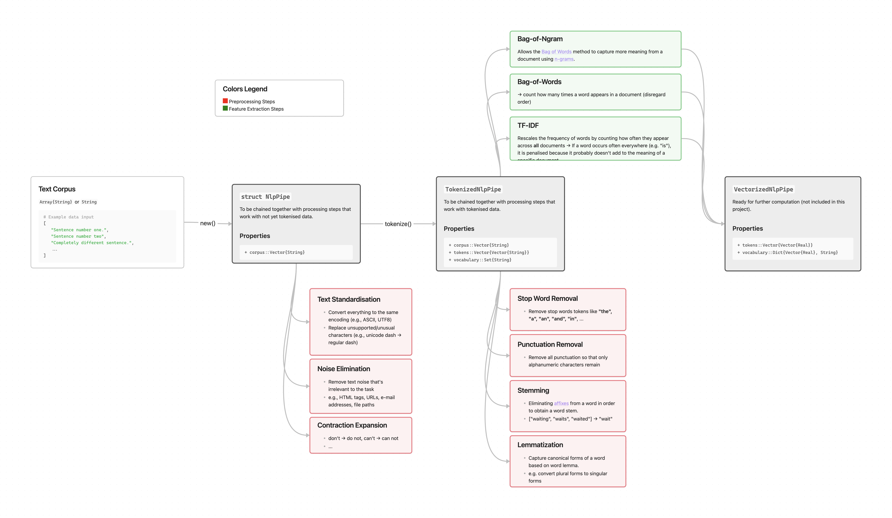

```@meta
CurrentModule = Preprocessing_Pipeline_JuML
```

# Preprocessing\_Pipeline\_JuML

[](https://michellekappl.github.io/Preprocessing_Pipeline_JuML/stable/)
[](https://codecov.io/gh/michellekappl/Preprocessing_Pipeline_JuML)
[](https://github.com/michellekappl/Preprocessing_Pipeline_JuML/actions/workflows/CI.yml?query=branch%3Amain)

**Preprocessing\_Pipeline\_JuML** is a Julia package for preprocessing text data in NLP pipelines.

## API Structure
The package provides a set of pipeline stages that can be chained together to preprocess text data. The pipeline stages are implemented as functions that take a `NlpPipe` or `TokenizedNlpPipe` struct as input and return a modified object of the same type. This makes it easy to build custom preprocessing pipelines by piping together the desired stages.

## Features and Objects

### Features (for detailed explanation visit [here](functions.md#preprocessing-before-tokenization))

- **Text preprocessing:** prepare textual data for machine learning tasks. Preprocessing steps include:
  - applied *before* Tokenization:
    - expansion of contractions
    - masking of numbers
    - noise removal (punctuation, special characters, phone numbers, e-mail addresses, ...)
    - text standardization (handle encoding & lowercasing)
  - applied *after* Tokenization:
    - stopword removal
    - stemming
    - standardization of token encoding
- **Tokenization:** Split text into words or characters.
- **Vectorization:** Transform text into machine-learning-compatible vector representations
  - one-hot encoding
  - Bag of Words (BoW)
  - Bag of N-Grams
  - Term Frequency-Inverse Document Frequency (TF-IDF)

### Pipe Objects (to learn more, visit [here](functions.md#pipe-structs))

**`NlpPipe`** First struct to instantiate in a pipeline. Can be created directly from a text corpus. Can be 
1. used in preprocessing stages that do **not** require the text to be tokenized.
2. transformed into a `TokenizedNlpPipe` by applying the `tokenize` function.

**`TokenizedNlpPipe`** Struct that holds tokenized text data. Can be used for preprocessing stages that require tokenized text (e.g., stopword removal, stemming, etc.). Can be transformed into a `VectorizedNlpPipe` by applying any vectorization function.

**`VectorizedNlpPipe`** Struct that holds vectorized text data (embeddings). Can be used for machine learning tasks.

### Overview


## Small example usage 
### (for big example visit [here](example.md))

```@example
using Preprocessing_Pipeline_JuML # hide

corpus=["Hello, world!", "How are you?"]
NlpPipe(corpus) |> remove_noise |> tokenize |> one_hot_encoding

```


